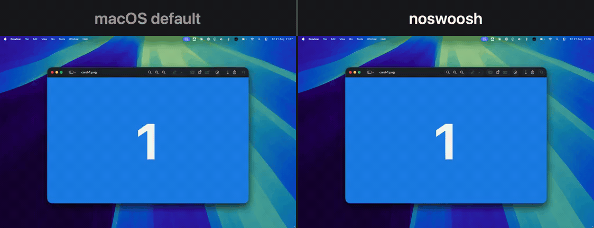

# noswoosh

Instant, animation-free switching between macOS Spaces (**3-finger swipe** or
**Ctrl+←/→**). Works on **macOS 26.6+ and 27**, no SIP disabling, no global Reduce
Motion.

[](https://github.com/mmathys/noswoosh/releases/latest)
[](LICENSE)




## Install

```sh
brew install --cask mmathys/tap/noswoosh
```

This installs `noswoosh.app`, runs the one-time system configuration, and starts a
login daemon.

Then **grant Accessibility permission** — macOS gates synthetic events behind it, and
it's the one step that can't be scripted. Approve the prompt on first start; if you
dismiss it, noswoosh opens **System Settings → Privacy & Security → Accessibility**
for you, where you can add `/Applications/noswoosh.app` yourself.

That's it — the daemon picks the grant up within a second, and both a **3-finger
horizontal swipe** and **Ctrl+←/→** switch spaces instantly.

<details>
<summary><b>Build from source instead</b></summary>

Requires Xcode Command Line Tools (`xcode-select --install`).

```sh
git clone https://github.com/mmathys/noswoosh.git
cd noswoosh
./scripts/install.sh
```

The installer compiles `noswoosh.swift` to `~/.local/bin/`, runs `noswoosh setup`, and
installs a LaunchAgent (`ax.max.noswoosh`) that logs to `~/Library/Logs/noswoosh.log`.
Grant Accessibility to `~/.local/bin/noswoosh`.

Set `NOSWOOSH_SIGN_IDENTITY="Developer ID Application: ..."` to codesign the local
build, which keeps the grant across rebuilds.

</details>

## Usage

Two ways to switch, both instant:

- **3-finger horizontal swipe** — your normal Spaces gesture, minus the animation.
  noswoosh intercepts the real swipe and replaces it with an instant switch;
  vertical swipes (Mission Control, App Exposé) are left untouched.
- **Ctrl+→ / Ctrl+←** — one space right/left.

Movement is clamped at the first and last space, so there's no rubber-band bounce.

A CLI is available for scripting and debugging:

```sh
noswoosh list      # "space 2 of 4"
noswoosh right     # switch once and exit
noswoosh left
noswoosh setup     # apply system config (teardown reverses it)
noswoosh teardown
noswoosh version
```

## How it works

macOS has no supported way to disable *only* the space-switch slide animation:

- The old `defaults write com.apple.dock workspaces-swoosh-animation-off` died with
  Lion (2011).
- **Reduce Motion** works but is global — and it's a crossfade, not an instant cut.
- Per-app accessibility settings (Reduce Motion for the Dock alone) exist on iOS, not
  macOS.
- yabai can do it, but only with SIP partially disabled.

noswoosh takes the approach used by
[InstantSpaceSwitcher](https://github.com/jurplel/InstantSpaceSwitcher),
[WhichSpace](https://github.com/gechr/WhichSpace) and BetterTouchTool: synthesize a
Dock-swipe trackpad gesture with **near-zero progress and high velocity**. The switch
runs through the Dock's own pipeline — so Mission Control, focus, wallpaper and Dock
state all stay consistent — but the animation has zero distance to travel, making it
instant.

Two input sources feed one switch core. An **event tap** watches for real 3-finger
horizontal swipes, suppresses them before the Dock animates, and posts the instant
switch — so a natural swipe still works, just without the slide. A Ctrl+arrow **hotkey**
posts the same switch directly. The two are independent: if the tap is ever disabled by
the system, Ctrl+←/→ keeps working.

**macOS 27** tightened this up: it validates synthetic Dock swipes against a serialized
IOHID payload the older technique doesn't carry, so pre-27 builds silently stop
switching. noswoosh detects the running OS and, on 27, attaches that payload (layout
reverse-engineered from [joshuarli/iss](https://github.com/joshuarli/iss)); on 26 it
uses the original lightweight path unchanged.

> The name: *swoosh* is Apple's own word for the space-slide animation, from the
> long-dead Snow Leopard setting `workspaces-swoosh-animation-off`. This is that
> setting, resurrected.

### The empty-desktop yank

While building this we found a macOS behavior reproducible with plain native
switching: **switch to a desktop with no windows, and ~400 ms later macOS yanks you to
a different desktop.** The chain, confirmed in the Dock's log and by instrumenting
app activations:

1. Landing on a space with no windows, macOS picks some other app and activates it.
2. That app orders its key window in — and that window lives on another space.
3. The Dock's window-order follow rule fires (`switching to space N for window(...)
   ordered on non-visible space`) and you're yanked to wherever that window lives.

The tempting fix is `defaults write com.apple.dock workspaces-auto-swoosh -bool NO`,
which stops the Dock registering for that notification at all. noswoosh shipped that
through 1.6.4 — and it costs you **Dock-icon-follow**, clicking a Dock icon to jump to
the space its window is already on. Disassembling the Dock shows why the two can't be
split: the rule's switcher has exactly *one* caller, that same notification block. One
pref, both behaviors. (It's also a separate code path from the "switch to a Space with
open windows when switching to an application" setting, `AppleSpacesSwitchOnActivate`
— toggling that does *not* help.)

So since 1.7.0 noswoosh leaves the pref alone and removes the **cause** instead: the
moment the daemon lands on a space with nothing to focus, it takes activation itself.
macOS still activates its pick, but that app never gets to order its off-space window
in first, so the follow never fires — measured margin is ~380 ms. Dock-icon-follow
keeps working, natively, with all of the Dock's own semantics intact.

The daemon has no windows and no menu, so the menu bar stays with whatever macOS
picked and nothing is visible. The only trace is that keystrokes typed at an empty
desktop go nowhere — which is where they were already going.

**macOS 27 doesn't need this, and doesn't get it.** 27 activates Finder on a windowless
landing; Finder owns the desktop and has no off-space window to order in, so the chain
never starts. The guard is gated off on 27+ — running it there would only displace
Finder, and on an empty desktop that's the app you want active.

Two variants that seem like they should work and don't, recorded so nobody re-tries
them: parking a real window on the destination space (verified resident — it still
yanks, so emptiness is the trigger, not the cause), and taking activation *before* the
switch (the switch re-activates macOS's pick on landing and wipes it out).

## Troubleshooting

**Ctrl+arrows or swipes do nothing.** Check `~/Library/Logs/noswoosh.log`. A
`waiting for Accessibility permission` line as the last entry means the daemon still
isn't trusted; once you grant it, the log shows `Accessibility granted` and the daemon
restarts itself. A `could not create swipe event tap` line means the same thing — the
tap needs Accessibility, and the restart after granting fixes it.

**The Accessibility checkbox won't stick.** Remove the entry with "−" and let the
daemon re-trigger the prompt, then approve it. If it still won't take:

```sh
launchctl kickstart -k gui/$(id -u)/ax.max.noswoosh
```

**Spaces switch in an unexpected order.** Turn off "Automatically rearrange Spaces
based on most recent use" in System Settings → Desktop & Dock.

## Caveats

- **macOS 26.0–26.5 is not supported** (Apple fixed the underlying bug by 26.6).
  Those builds have a WindowServer race where a zero-travel synthetic switch drops the
  destination space's window compositing surfaces: the switch itself works, but you can
  land on a space whose windows never paint (blank wallpaper) until something re-orders
  them. The full investigation — root cause, every attempted workaround (alternate event
  shapes, phase pacing, surface pre-warming, post-landing heals, direct SkyLight
  switching), and why each fails — is in
  [issue #1](https://github.com/mmathys/noswoosh/issues/1). **The fix is to update
  macOS to 26.6 or later.**
- **Private APIs.** `SLSCopyManagedDisplaySpaces`, the undocumented gesture
  `CGEventField`s, and the macOS 27 IOHID payload layout are all unsupported by Apple
  and reverse-engineered — any macOS release can change them. When a release does, the
  symptom is switches silently stopping; the fix is adapting the gesture payload (as the
  26 → 27 change already required). noswoosh gates each path behind a runtime OS check so
  a future break can be isolated to one path.
- **Apple Silicon quirk (macOS 26 path).** The reference implementations use
  `FLT_TRUE_MIN` as the gesture progress; that subnormal float is flushed to zero (sign
  lost) somewhere in the event pipeline on Apple Silicon, making every switch go the
  same direction. This port uses `1e-4`, which survives and is still visually zero.

## Uninstall

```sh
brew uninstall --cask noswoosh     # or: ./scripts/uninstall.sh, from source
```

This stops the daemon, removes the LaunchAgent, and restores the system Ctrl+arrow
shortcuts that `setup` disabled. Remove the Accessibility entry manually if you like.

## Contributing

Issues and pull requests are welcome. The whole tool is one Swift file
([`noswoosh.swift`](noswoosh.swift)); build it with:

```sh
swiftc noswoosh.swift -O -o noswoosh \
    -F /System/Library/PrivateFrameworks -framework SkyLight
```

Releases are cut by bumping `noswooshVersion` and pushing a matching `vX.Y.Z` tag;
CI builds, signs and publishes the app and updates the Homebrew cask.

## Credits

- Gesture technique: [jurplel/InstantSpaceSwitcher](https://github.com/jurplel/InstantSpaceSwitcher)
  (the `±FLT_TRUE_MIN` progress trick and three-phase gesture) and
  [gechr/WhichSpace](https://github.com/gechr/WhichSpace).
- macOS 27 IOHID payload and swipe-interception approach:
  [joshuarli/iss](https://github.com/joshuarli/iss) (ISC).
- Force-front technique: [koekeishiya/yabai](https://github.com/koekeishiya/yabai).

## License

MIT — see [LICENSE](LICENSE).
